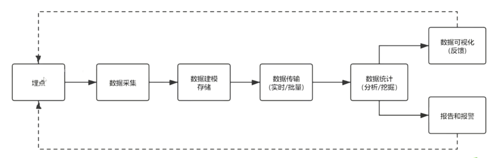

# 前端监控
 
## 一、为什么要做监控
1. 更快发现问题并解决问题
2. 做产品的决策依据
3. 提升前端工程师的技术深度和广度，打造简历亮点
4. 为业务拓展提供了更多可能性

## 二、前端监控目标
### 1、稳定性（stability）
|错误名称|备注|
--|--|--
|JS错误|JS执行错误或者promise异常|
|资源异常|script或者link资源加载异常|
|接口错误|ajax或者fetch请求接口异常|
|白屏|页面空白|

```js
// js执行序错误和资源加载 错误可以通过监听error事件来捕获
window.addEventListener('error', (e) => {
  if (e.target && (e.target.src || e.target.href)) { // 资源加载错误
    ...
  } else { // js执行错误
    ...
  }
})

// promise异常, 可以通过监听unhandledrejection事件来捕获
window.addEventListener('unhandledrejection', (e) => {
  console.log(e)
})
```


### 2、用户体验(experience)
|错误名称|备注|
--|--|--
|加载时间|各个阶段的加载时间|
|fFB(tim to first byte)(首字节时间)|是指浏览器发起第一个请求到数据返回第一个字节所消耗的时间，这个时间包含了网络请求时间、后端处理时间|
|FP(First Paint)(首次绘制)|首次绘制包括了任何用户自定义的背景绘制，它是将第一个像素点绘制到屏幕的时刻|
|FCP(First Content Paint)(首次内容绘制)|首次内容绘制是浏览器将第一个DOM渲染到屏幕的时间，可以是任何文本、图像、SVG等的时间|
|FMP(First Meaningful paint)(首次有意义绘制)|首次有意义绘制是页面可用性的量度标准|
|FID(First Input Delay)(首次输入延迟|用户首次和页面交互到页面响应交互的时间|
|卡顿|超过50ms的长任务|

### 3、业务(business)
|错误名称|备注|
--|--|--
|PV|page view即页面浏览量或点击量|
|UV|指访问某个站点的不同IP地址的人数|
|页面的停留时间|用户在每一个页面的停留时间|

## 三、前端监控流程
1. 前端埋点
2. 数据上报
3. 分析和计算 将采集到的数据进行加工和汇总
4. 可视化展示 将数据按照各种维度进行展示
5. 监控报警 发现问题后按照一定的条件触发报警



## 四、常见埋点方案
1. 代码埋点
- 就是以嵌入代码的形式进行埋点比如需要监控用户的点击事件，会选择在用户点击时，插入一段代码，保存这个监听行为或者直接将监听行为以某一种数据格式直接传递给服务器端
- 优点：可以在任意时刻，精确的发送或保存所需要的数据信息；
- 缺点：工作量较大

2. 可视化埋点
- 通过可视化交互的手段，代替代码埋点
- 将业务代码和埋点代码分离，提供一个可视化交互的页面，输入为业务代码，通过这个可视化系统，可以在业务代码中自定义的增加埋点事件等等,最后输出的代码偶合了业务代码和埋点代码
- 可视化埋点其实是用系统来代替手工插入埋点代码

3. 无痕埋点
- 前端的任意一个事件都被绑定一个标识，所有的事件都别记录下来
- 通过定期上传记录文件，配合文件解析，解析出来我们想要的数据，并生成可视化报告供专业人员分析
- 无痕埋点的优点是采集全量数据，不会出现漏埋和误埋等现象
- 缺点是给数据传输和服务器增加压力，也无法灵活定制数据结构
