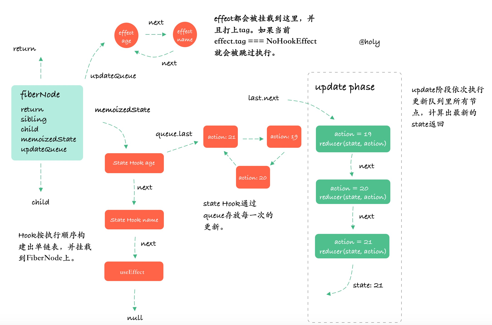

# react hooks

## useState


```js
let isMount = true; // false是更新阶段
let workInProgressHook = null; // 链表指针

const fiber = {
  stateNode: App, // 当前函数组件
  memoizedState: null // 存储了组件内部的所有hooks组建的单向链表
}

function useState(initialState) {
  let hook;
  if (isMount) {
    hook = {
      memoizedState: initialstate,
      next: null,
      queue: null, // 每个state hooks内部有一个循环链表储存了每次通过setXxx更新的最新值
      pending: null
    }
    
    if (!fiber.memoizedState) {
      fiber.memoizedstate = hook;
    } else {
      workInProgressHook.next = hook;
    }
    workInProgressHook = hook;
  } else {
    hook = workInProgressHook;
    workInProgressHook = workInProgressHook.next;
  }
  let basestate = hook.memoizedstate;
  if (hook.queue.pending) {
    let firstUpdate = hook.queue.pending.next;
    do {
      const action = firstUpdate.action;
      basestate = action(baseState);
      firstUpdate = firstUpdate.next;
    } while (firstUpdate !== hook.queue.pending.next)
    hook.queue.pending = null;
  }
    hook.memoizedstate = basestate;

  return [basestate, dispatchAction.bind(null, hook.queue)];
}

function dispatchAction(queue, action){
  // 调用setXxx()时 也就是执行dispatchAction()会把当前hooks对应的循环链表传进来（所以知道当前更新的是哪个state）
  const update = {
    action,
    next:null
  }
  
  if (queue.pending ==null) {
    //u0->u0->u0
    update.next = update;
  } else {
    //u0->u0
    //u1->u0->u1
    update.next = queue.pending.next;
    queue.pending.next = update;
  }
  queue.pending = update;
  schedule(); // 每次setXxx()时，都会重新执行调度
}

function schedule(){
  workInProgressHook = fiber.memoizedstate;
  const app = fiber.stateNode();
  isMount false;
  return app;
}

```
##### useState和useReducer如何在每次渲染时，返回最新的值？
1. 每个Hook节点通过循环链表记住所有的更新操作
2. 在update阶段会依次执行update循环链表中的所有更新操作，最终拿到最新的state返回

## useEffect

useEffect做了什么？

1. FiberNdoe节点中会又一个updateQueue链表来存放所有的本次渲染需要执行的effect。
2. mountEffect阶段和updateEffect阶段会把effect 挂载到updateQueue上。
3. updateEffect阶段，deps没有改变的effect会被打上NoHookEffect tag，commit阶段会跳过该Effect。


## 总结
##### React 如何管理区分Hooks？
1. React通过单链表来管理Hooks
2. 按Hooks的执行顺序依次将Hook节点添加到链表中
   

